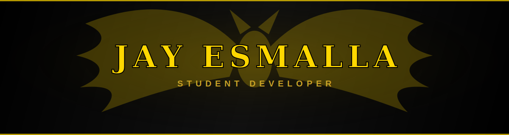

<div align="center">




</div>


<br>

<table align="center">
<tr>
<td valign="top" width="50%">

### 🦇 Quick Info

```yaml
alias:        Jay
role:         Student Developer
specialty:    Flutter & Dart
side_quest:   Machine Learning
base:         Davao, Philippines
```

</td>
<td valign="top" width="50%">

### 🌃 Currently

- 🔭 Building mobile apps with Flutter
- 🌱 Learning Machine Learning
- 🤝 Open to collaborating on projects
- 💬 Feel free to reach out

</td>
</tr>
</table>


<div align="center">

## ⚡ Frontend & Mobile


## 🛠️ Backend & Data


## 🧰 Tools


</div>


<br><br>


</div>
