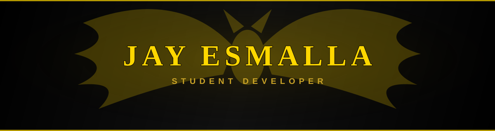

<div align="center">

</div>

<table align="center">
<tr>
<td valign="top" width="50%">

### 🦇 Quick Info
```yaml
alias:        Jay
role:         Student Developer
specialty:    Flutter & Dart
side_quest:   Machine Learning
base:         Davao, Philippines
```
</td>
<td valign="top" width="50%">

### 🌃 Currently
- 🔭 Building mobile apps with Flutter
- 🌱 Learning Machine Learning
- 🤝 Open to collaborating on projects
- 💬 Feel free to reach out
</td>
</tr>
</table>


<div align="center">

### 🎀 Mood Board


</div>


<div align="center">

## 🧰 Tech Stack


</div>


<picture>
  <source media="(prefers-color-scheme: dark)" srcset="https://raw.githubusercontent.com/jaeqwrty/jaeqwrty/output/github-contribution-grid-snake-dark.svg" />
  <source media="(prefers-color-scheme: light)" srcset="https://raw.githubusercontent.com/jaeqwrty/jaeqwrty/output/github-contribution-grid-snake.svg" />
  
</picture>
